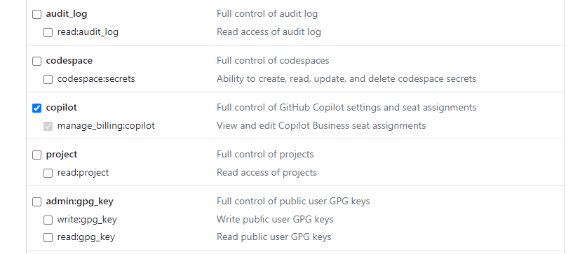

# Github copilot admin doc:

## Index:
1. [Github Copilot Stats](#github-copilot-stats)
2. [Ignore env, secrets or other files for all members](#ignore-env-secrets-or-other-files-for-all-members)
3. [Enable or disable Copilot features for all members](#enable-or-disable-copilot-features-for-all-members)

## Github Copilot Stats:
Copilot provide us usage stats to see how copilot is used by members in the organization.

See more details about usage stats API [here](https://docs.github.com/en/rest/copilot/copilot-usage?apiVersion=2022-11-28#get-a-summary-of-copilot-usage-for-organization-members)

### How to generate API token to collect Copilot stats:
***A user with admin access or copilot manage billing access should generate this token.***

1. In the upper-right corner of any page on GitHub, click your profile photo, then click Settings.
2. In the left sidebar, click  Developer settings.
3. In the left sidebar, under  Personal access tokens, click Tokens (classic).
4. Select Generate new token, then click Generate new token (classic).
5. In the "Note" field, give your token a descriptive name.
6. To give your token an expiration, select Expiration, then choose a default option or click Custom to enter a date.
7. Select the scopes you'd like to grant this token. Under Copilot section, select `manage_billing:copilot` permission.

8. Click Generate token.
9. Copy the token and use to get stats.

## Ignore env, secrets or other files for all members:
Follow instruction: [Configuring content exclusions for your organization](https://docs.github.com/en/copilot/managing-copilot/configuring-and-auditing-content-exclusion/excluding-content-from-github-copilot#configuring-content-exclusions-for-your-organization)

Follow instruction: [Configuring content exclusions for your repository](https://docs.github.com/en/copilot/managing-copilot/configuring-and-auditing-content-exclusion/excluding-content-from-github-copilot#configuring-content-exclusions-for-your-repository)

## Enable or disable Copilot features for all members:
Use following link to enable or disable some feature like chat, access to Bing, enable new models(Anthropic Claude 3.5 Sonnet, OpenAI o1): [Enabling Copilot features in your organization](https://docs.github.com/en/copilot/managing-copilot/managing-github-copilot-in-your-organization/managing-policies-for-copilot-in-your-organization#enabling-copilot-features-in-your-organization)
